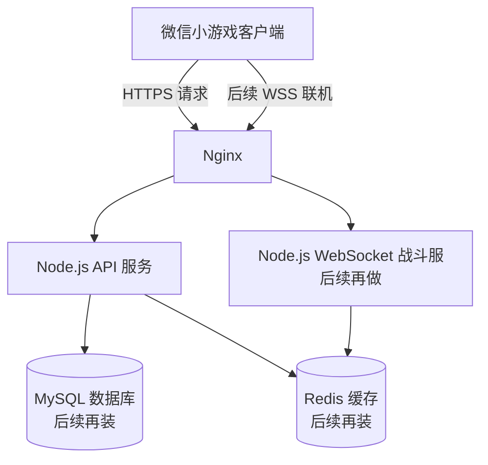
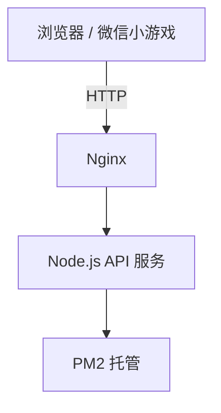

# 微信小游戏后端从 0 到 1：小白可跟做的完整部署教程（含踩坑与解决）

这篇文章是按**真正从零开始**写的。  
目标不是讲概念，而是带你把一台空服务器，做成一个**可以给微信小游戏提供后端能力**的真实线上环境。

你会得到：

- 一个运行中的 Node.js API 服务
- 一个用 PM2 托管、不会因为关窗口就退出的服务
- 一个 Nginx 反向代理入口
- 一个可以公网访问的接口
- 一份清晰的后端基础架构认知
- 一份常见报错与解决手册

这篇文章适合：

- 第一次接触 Linux 服务器的人
- 想做微信小游戏后端的人
- 想做双人联机小游戏，但还没把服务器跑起来的人

---

# 一、我们最终要做成什么

先别急着敲命令，先知道我们要做成什么。

## 目标架构图



## 当前这篇文章先完成哪一部分

这篇文章先完成：



也就是说，我们先把**最基础的业务接口**跑起来。  
后面的 WebSocket、Redis、MySQL，可以在这篇基础上继续扩展。

---

# 二、服务器配置与环境说明

我这次使用的是：

- Ubuntu 22.04
- 2核 4G 内存
- 香港节点
- root 用户登录

为什么这样选：

- **Ubuntu**：教程最多，最适合新手
- **2核 4G**：跑 Node + Nginx + 后续 Redis/MySQL 都更稳
- **香港**：离微信生态用户更近，延迟更低
- **root**：前期操作最简单，少掉很多权限问题

---

# 三、第一步：登录服务器

如果你用的是腾讯云控制台，可以直接使用：

- **免密连接（TAT）**
- 用户名：`root`

登录成功后，你会看到类似这样的终端：

```bash
root@VM-0-15-ubuntu:~#
```

看到这个提示符，就说明你已经进入服务器了。

---

# 四、第二步：更新系统

先执行：

```bash
apt update && apt upgrade -y
```

这一步是为了：

- 更新软件源
- 升级系统组件
- 避免后面安装 Node / Nginx 时依赖有问题

## 这一步可能遇到的提示

### 问题 1：出现服务重启提示窗口

你可能会看到一个蓝底白字的界面，大意是：

- 有一些服务用了旧库
- 需要重启服务

### 解决方法

不用慌，保持默认即可：

- 按 `Tab`
- 移动到 `<Ok>`
- 按 `Enter`

## 问题 2：出现 “System restart required”

你可能会看到类似：

- 内核升级了
- 建议重启

### 解决方法

**先不要重启。**

因为我们还在连续部署环境，重启会打断当前过程。  
等全部环境装完，如果你愿意，再统一重启。

---

# 五、第三步：安装 Node.js

Node.js 是我们后端服务的运行环境。  
没有它，后端代码就跑不起来。

## 1）添加 Node 20 源

```bash
curl -fsSL https://deb.nodesource.com/setup_20.x | bash -
```

执行成功后，你会看到类似提示：

```bash
Repository configured successfully.
To install Node.js, run: apt install nodejs -y
```

这说明 Node 源已经配好了。

## 2）安装 Node.js

```bash
apt install -y nodejs
```

## 3）验证是否安装成功

```bash
node -v
npm -v
```

正常会输出类似：

```bash
v20.20.2
10.8.2
```

---

# 六、第四步：安装 PM2

PM2 是 Node.js 进程管理工具。  
它的作用非常重要：

- 程序崩了可以自动拉起来
- 关掉终端，程序也不会停
- 服务器重启后还能自动启动

## 安装 PM2

```bash
npm install -g pm2
```

## 验证安装

```bash
pm2 -v
```

正常会输出一个版本号，比如：

```bash
6.0.14
```

---

# 七、第五步：创建第一个后端服务

这一部分是整篇文章最关键的开始。

我们要自己写一个最简单的 Node.js API 服务，让它先能返回一个 JSON。

## 1）创建项目目录

```bash
mkdir -p /srv/tank-game/api
cd /srv/tank-game/api
```

这里目录名你可以自己改，但建议照着教程来，避免后面路径不一致。

## 2）初始化项目

```bash
npm init -y
```

执行后会生成一个 `package.json`，表示这是一个 Node 项目。

## 3）安装依赖

```bash
npm install express cors
```

这里两个库分别是：

- `express`：用来写后端接口
- `cors`：处理跨域，方便前端调用

---

# 八、第六步：写后端代码

现在开始写代码。

## 创建文件

```bash
vim server.js
```

进入编辑器后：

- 按 `i` 进入编辑模式
- 把下面完整代码粘进去

## 完整代码：server.js

```js
const express = require('express');
const cors = require('cors');

const app = express();

// 允许跨域请求
app.use(cors());

// 支持 JSON 请求体
app.use(express.json());

/**
 * 健康检查接口
 * 用来确认服务是否正常运行
 */
app.get('/health', (req, res) => {
  res.json({
    ok: true,
    msg: 'server running'
  });
});

/**
 * 测试接口
 * 模拟小游戏后端返回数据
 */
app.get('/api/test', (req, res) => {
  res.json({
    code: 0,
    message: 'hello tank game',
    data: {
      time: Date.now()
    }
  });
});

const PORT = 7001;

app.listen(PORT, () => {
  console.log('API running on port ' + PORT);
});
```

## 保存退出 vim

如果你是第一次用 vim，这里一定要记住：

1. 按 `Esc`
2. 输入：

```text
:wq
```

3. 按 `Enter`

### 如果你不想保存，强制退出

```text
:q!
```

---

# 九、第七步：先本地运行服务

执行：

```bash
node server.js
```

正常你会看到：

```bash
API running on port 7001
```

这说明你的 Node 服务已经启动了。

## 这一步意味着什么

说明：

- 代码没有语法错误
- Node 环境正常
- 7001 端口监听成功

---

# 十、第八步：本机测试接口

现在先不要急着对外开放。  
先在服务器本机上测一下它是不是正常工作。

因为当前窗口已经在跑 `node server.js`，你需要：

- 在腾讯云终端顶部点 `+` 开一个新标签页
- 或者另开一个终端连接

然后执行：

```bash
curl http://127.0.0.1:7001/health
```

正常会返回：

```json
{"ok":true,"msg":"server running"}
```

这说明：

- 接口服务已经真的启动了
- 本机访问完全正常

---

# 十一、第九步：为什么不能一直用 node server.js 裸跑

虽然现在服务能跑，但如果你这样运行：

```bash
node server.js
```

它有一个大问题：

- 关闭终端就没了
- 断开 SSH 连接就没了
- 服务器重启也没了

所以，我们必须把它交给 PM2 托管。

---

# 十二、第十步：用 PM2 托管服务

## 1）先停掉当前 node 进程

回到那个在跑 `node server.js` 的终端，按：

```text
Ctrl + C
```

## 2）进入项目目录

```bash
cd /srv/tank-game/api
```

## 3）用 PM2 启动

```bash
pm2 start server.js --name tank-api
```

正常会看到：

```text
tank-api   online
```

## 4）查看进程列表

```bash
pm2 list
```

正常会显示一个在线进程，例如：

```text
│ 0  │ tank-api │ fork │ 0 │ online │ 0% │ 55.8mb │
```

---

# 十三、第十一步：让 PM2 开机自启

## 1）保存当前进程列表

```bash
pm2 save
```

## 2）设置开机自启

```bash
pm2 startup
```

正常情况下，PM2 会自动帮你创建 systemd 服务。  
如果它提示你再执行一串命令，就照着执行。

有时候它会直接成功，并提示：

```text
[PM2] Freeze a process list on reboot via:
$ pm2 save
```

如果是这种情况，再执行一次：

```bash
pm2 save
```

就行。

## 这一步的意义

这样以后就算服务器重启，`tank-api` 也会自动回来。

---

# 十四、第十二步：安装 Nginx

Node 服务虽然已经跑了，但它现在还只能通过：

```text
http://127.0.0.1:7001
```

这种本机地址访问。

如果想让浏览器或微信小游戏访问，我们需要一个对外入口。  
这个入口一般就是 **Nginx**。

## 安装 Nginx

```bash
apt install -y nginx
```

## 启动并设置开机自启

```bash
systemctl enable nginx
systemctl start nginx
systemctl status nginx
```

如果你看到：

```text
Active: active (running)
```

说明 Nginx 已经正常运行。

## 浏览器测试

这时你可以直接在本地电脑浏览器打开：

```text
http://你的服务器IP
```

正常会看到：

```text
Welcome to nginx!
```

这说明：

- Nginx 已启动
- 80 端口可访问
- 公网到服务器这条链路通了

---

# 十五、第十三步：配置 Nginx 代理到 Node 服务

现在我们要做一件关键的事：

> 让外部访问 `/api/test`，实际由 Nginx 转发给本地 7001 端口的 Node 服务。

## 1）打开默认配置文件

```bash
vim /etc/nginx/sites-available/default
```

## 2）清空原来的内容

进入 vim 后：

- 按 `Esc`
- 输入：

```text
:%d
```

- 回车

## 3）粘贴下面这份完整配置

```nginx
server {
    listen 80 default_server;
    listen [::]:80 default_server;

    server_name _;

    location /api/ {
        proxy_pass http://127.0.0.1:7001;
        proxy_http_version 1.1;
        proxy_set_header Host $host;
        proxy_set_header X-Real-IP $remote_addr;
    }

    location / {
        return 200 'nginx ok';
        add_header Content-Type text/plain;
    }
}
```

## 4）保存退出

- 按 `Esc`
- 输入：

```text
:wq
```

- 回车

---

# 十六、第十四步：检查 Nginx 配置是否正确

执行：

```bash
nginx -t
```

如果正常，会看到：

```text
syntax is ok
test is successful
```

## 重新加载 Nginx

```bash
systemctl reload nginx
```

这一步不需要重启，只是让新配置生效。

---

# 十七、第十五步：本机测试 Nginx 代理

现在执行：

```bash
curl http://127.0.0.1/api/test
```

正常应该返回：

```json
{"code":0,"message":"hello tank game","data":{"time":1776422615383}}
```

如果这里成功，说明：

- Nginx 转发成功
- Node 服务正常
- 路由也正常

---

# 十八、第十六步：公网测试

最后一步，在你自己电脑浏览器里打开：

```text
http://你的服务器IP/api/test
```

正常会看到一段 JSON，例如：

```json
{"code":0,"message":"hello tank game","data":{"time":1776422658932}}
```

看到这里，就说明你已经完成了：

- 服务器环境搭建
- Node 服务部署
- PM2 托管
- Nginx 网关
- 公网接口上线

---

# 十九、我们这一路遇到过哪些问题，怎么解决

这一节是最重要的“踩坑记录”，小白一定要看。

---

## 问题 1：蓝色弹窗，不知道怎么办

### 现象
系统更新或安装软件时，弹出蓝底窗口，让你选择服务重启。

### 原因
Ubuntu 更新了系统库，需要你确认要不要重启相关服务。

### 解决方法
保持默认即可：

- `Tab`
- 移动到 `<Ok>`
- `Enter`

### 结论
这是正常流程，不是报错。

---

## 问题 2：提示 “System restart required”，要不要 reboot

### 现象
安装或升级后，系统提示建议重启。

### 原因
内核升级了，但当前还在使用旧内核。

### 解决方法
**先不要重启。**

因为我们还在连续安装环境，等所有步骤做完后，如果你愿意再统一重启。

---

## 问题 3：不会退出 vim

### 现象
打开 `vim server.js` 后，看到一堆 `~`，不知道怎么退出。

### 原因
vim 不是普通文本编辑器，需要用命令退出。

### 解决方法

#### 保存退出
1. 按 `Esc`
2. 输入 `:wq`
3. 回车

#### 不保存退出
1. 按 `Esc`
2. 输入 `:q!`
3. 回车

---

## 问题 4：服务明明启动了，为什么 `curl` 要新开终端

### 现象
当前窗口已经在跑：

```bash
node server.js
```

再输入其他命令没反应。

### 原因
当前终端已经被 Node 进程占用了。

### 解决方法
在腾讯云终端顶部点击 `+` 开一个新标签页，再执行测试命令。

---

## 问题 5：用 `node server.js` 启动，关掉窗口服务就没了

### 原因
这是前台运行，SSH 断开时进程也结束。

### 解决方法
必须用 PM2 托管：

```bash
pm2 start server.js --name tank-api
```

---

## 问题 6：浏览器里还是 “Welcome to nginx!”

### 现象
你明明已经改了配置，但打开 IP 还是 Nginx 默认欢迎页。

### 可能原因
- 配置没改对
- 没保存
- 没 reload Nginx
- 还在用默认内容

### 解决方法
重新检查：

```bash
vim /etc/nginx/sites-available/default
nginx -t
systemctl reload nginx
```

---

## 问题 7：返回 `Cannot GET /test`

### 现象
执行：

```bash
curl http://127.0.0.1/api/test
```

结果返回：

```html
Cannot GET /test
```

### 原因
Nginx 把 `/api/` 前缀吃掉了。

错误写法是：

```nginx
proxy_pass http://127.0.0.1:7001/;
```

这个结尾的 `/` 会导致路径重写，把：

```text
/api/test
```

转成：

```text
/test
```

而你的 Node 代码里写的是：

```text
/api/test
```

所以对不上。

### 正确写法

```nginx
proxy_pass http://127.0.0.1:7001;
```

**注意：结尾不要带 `/`。**

---

# 二十、完整代码汇总

这一节专门给想直接照抄的人。

## 1）server.js 完整代码

```js
const express = require('express');
const cors = require('cors');

const app = express();

app.use(cors());
app.use(express.json());

app.get('/health', (req, res) => {
  res.json({
    ok: true,
    msg: 'server running'
  });
});

app.get('/api/test', (req, res) => {
  res.json({
    code: 0,
    message: 'hello tank game',
    data: {
      time: Date.now()
    }
  });
});

const PORT = 7001;

app.listen(PORT, () => {
  console.log('API running on port ' + PORT);
});
```

## 2）Nginx 完整配置

```nginx
server {
    listen 80 default_server;
    listen [::]:80 default_server;

    server_name _;

    location /api/ {
        proxy_pass http://127.0.0.1:7001;
        proxy_http_version 1.1;
        proxy_set_header Host $host;
        proxy_set_header X-Real-IP $remote_addr;
    }

    location / {
        return 200 'nginx ok';
        add_header Content-Type text/plain;
    }
}
```

---

# 二十一、完整命令清单

如果你想从头快速过一遍，这里是完整命令顺序。

## 1）系统更新

```bash
apt update && apt upgrade -y
```

## 2）安装 Node

```bash
curl -fsSL https://deb.nodesource.com/setup_20.x | bash -
apt install -y nodejs
node -v
npm -v
```

## 3）安装 PM2

```bash
npm install -g pm2
pm2 -v
```

## 4）创建 API 项目

```bash
mkdir -p /srv/tank-game/api
cd /srv/tank-game/api
npm init -y
npm install express cors
```

## 5）运行并测试

```bash
node server.js
curl http://127.0.0.1:7001/health
```

## 6）PM2 托管

```bash
pm2 start server.js --name tank-api
pm2 list
pm2 save
pm2 startup
pm2 save
```

## 7）安装 Nginx

```bash
apt install -y nginx
systemctl enable nginx
systemctl start nginx
systemctl status nginx
```

## 8）检查与重载 Nginx

```bash
nginx -t
systemctl reload nginx
```

## 9）测试代理

```bash
curl http://127.0.0.1/api/test
```

---

# 二十二、现在你已经具备什么能力

到这里，你的服务器已经不是“空机器”了。

你已经具备：

- 一个真实在线的 Node.js 后端服务
- 一个可以公网访问的接口
- 一个 PM2 守护进程体系
- 一个 Nginx 对外网关

对于微信小游戏来说，这已经是**后端基础环境**了。

你可以在这个基础上继续扩展：

- 登录接口
- 玩家数据接口
- 配置接口
- 房间接口
- 排行榜接口
- 后续 WebSocket 联机服务

---

# 二十三、如果你接下来要做双人联机小游戏，下一步该做什么

最合理的顺序是：

## 1. 安装 Redis
用来做：

- 房间状态
- 在线状态
- 临时战斗状态缓存

## 2. 安装 MySQL
用来存：

- 用户信息
- 搭子进度
- 排行榜
- 战绩

## 3. 新建 battle 服务
用 `ws` 写一个 WebSocket 服务，后面通过 Nginx 挂到 `/ws/`

## 4. 申请域名和 HTTPS
因为微信小游戏正式环境最终需要：

- `https://`
- `wss://`

---

# 二十四、最后总结

这篇文章做的事情，其实就三层：

## 第一层：运行环境
- Ubuntu
- Node.js

## 第二层：进程管理
- PM2

## 第三层：对外入口
- Nginx

很多人觉得部署难，是因为一下子看到太多概念。  
其实拆开之后，就是这几件事：

1. 把程序写出来
2. 把程序跑起来
3. 让程序一直活着
4. 让外网能访问它

只要这四步打通，你就已经从“没有服务器经验”，走到了“能跑真实线上服务”。

---

# 二十五、附：这篇文章适合作为后续系列的第一篇

如果你准备继续做微信小游戏后端，我建议后续可以继续写：

- 第二篇：Redis + MySQL 安装与接入
- 第三篇：WebSocket 战斗服务搭建
- 第四篇：微信小游戏前端对接 API / WSS
- 第五篇：双人联机房间与进度系统设计

这样就能从“服务器搭建”一路写到“联机游戏上线”。

如果你正在跟着这篇文章做，那恭喜你：

> 你已经把第一块地基真正搭起来了。
