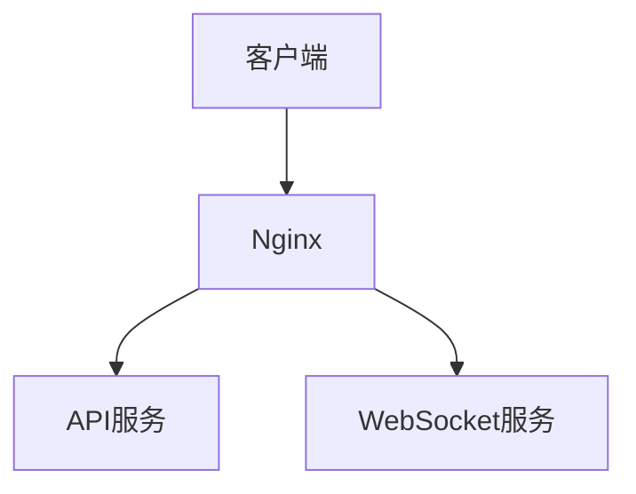
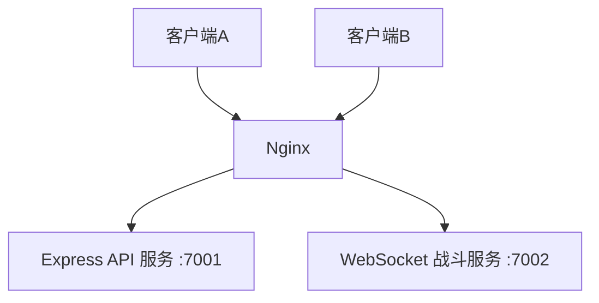

# 微信小游戏后端开发（二）：WebSocket 战斗服务（双人联机基础）

上一篇我们已经完成了 **第 1 步：基础服务器搭建**，包括 Node.js、PM2、Express API、Nginx 反向代理，以及 `/api/` 公网访问。

这一篇正式进入：

> **第 2 步：WebSocket 战斗服务**

这一阶段的目标不是一下子把坦克对战全部做完，而是先把**实时通信链路**搭起来。  
因为双人联机游戏最核心的一点就是：

- 玩家 A 发消息
- 服务端收到
- 玩家 B 能实时收到

只有这条链路通了，后面的房间系统、战斗同步、子弹同步、帧同步才有基础。

---

## 🧠 1. 本篇目标

这一篇要解决的问题很明确：

### 这一阶段要做什么？

我们要单独创建一个 `battle` 服务，用来负责 WebSocket 长连接通信，实现：

- 客户端连接
- 客户端断开
- 消息广播
- 心跳检测（ping/pong）
- PM2 托管
- Nginx 反向代理 `/ws/`

最终达到的效果是：

> 两个客户端可以通过 WebSocket 互发消息。

---

### 在整个架构中的位置

整体路线保持不变：

- **第 1 步：基础服务器搭建（已完成）**
- **第 2 步：WebSocket 战斗服务（当前阶段）**
- **第 3 步：房间系统**
- **第 4 步：战斗同步**
- **第 5 步：数据系统（MySQL + Redis）**
- **第 6 步：微信接入 + 架构优化**

你可以把第 2 步理解成：

> 给整个联机游戏先装上一条“实时通信神经”。

---

## 🧱 2. 架构图（必须先看懂）

在这个阶段，整体架构非常简单：



如果再稍微展开一点，可以理解成这样：



### 这张图怎么理解？

- **客户端**：微信小游戏、浏览器测试页、或者调试工具
- **Nginx**：统一公网入口
- **API 服务**：处理普通 HTTP 请求，比如登录、用户信息、配置接口
- **WebSocket 服务**：处理实时长连接，比如玩家消息同步、房间广播、战斗事件

为什么要拆成两个服务？

因为：

1. **API 是请求-响应模型**
2. **WebSocket 是持续连接模型**

这两类服务工作方式不同，拆开后后面更好维护，也更容易扩展。

---

## 🚀 3. 一步一步实操（重点）

这一部分按真实开发顺序来，不跳步骤。

---

### 第一步：创建 `battle` 目录

先进入项目根目录：

```bash
cd /srv/tank-game
mkdir battle
cd /srv/tank-game/battle
```

### 为什么这么做？

因为我们不希望把 WebSocket 逻辑直接塞进已有的 `api` 服务里。

现在项目结构建议是这样：

```bash
/srv/tank-game
├── api
└── battle
```

这样做的好处：

- API 和战斗服务职责分离
- 后面更容易扩展成多个服务
- 排查问题更清晰

比如以后看到 `tank-api` 挂了，你知道是 HTTP 问题；  
看到 `tank-battle` 挂了，你知道是联机问题。

---

### 第二步：初始化 Node.js 项目

在 `battle` 目录执行：

```bash
npm init -y
```

### 为什么这么做？

这一步会生成 `package.json`，相当于这个服务的项目说明书。

它负责记录：

- 项目名称
- 依赖包
- 启动方式
- 版本信息

没有它，后面安装依赖和管理服务都会不规范。

---

### 第三步：安装 `ws`

执行：

```bash
npm install ws
```

### 为什么用 `ws`？

Node.js 本身不直接提供完整的 WebSocket 服务端能力，所以我们需要安装一个库。

`ws` 的优点是：

- 轻量
- 稳定
- 社区使用广泛
- 非常适合当前这种小游戏联机原型阶段

对于“先跑通，再逐步升级”的项目来说，它很合适。

---

### 第四步：创建 `server.js`

执行：

```bash
touch server.js
```

### 为什么要单独建这个文件？

因为它就是 WebSocket 战斗服务的入口文件。  
后面你手动启动、PM2 启动，都是跑它。

---

### 第五步：编写 WebSocket 服务代码

这一阶段我们需要的最小能力包括：

- 接收客户端连接
- 给每个连接分配一个简单客户端 ID
- 收到消息后广播给所有在线客户端
- 定时 ping，检测连接是否还活着
- 连接关闭时能清理

完整代码放在下面的“完整代码”章节。

---

### 第六步：先手动启动服务

先不要急着上 PM2，先直接运行：

```bash
node server.js
```

### 为什么先手动启动？

因为现在属于开发调试阶段。  
如果代码有语法错误、端口冲突、依赖问题，直接在终端里看最清楚。

只有确认服务能正常启动后，再交给 PM2 托管，才是更稳的做法。

如果启动成功，会看到类似输出：

```bash
===================================
Tank Battle WebSocket 服务已启动
监听地址: ws://0.0.0.0:7002
推荐代理入口: /ws/
===================================
```

---

### 第七步：用 PM2 托管 battle 服务

确认手动启动没问题后，先停止当前进程：

```bash
Ctrl + C
```

然后执行：

```bash
pm2 start server.js --name tank-battle
pm2 list
pm2 logs tank-battle --lines 30
pm2 save
```

### 为什么一定要用 PM2？

因为手动 `node server.js` 有几个问题：

- SSH 断开后服务就停了
- 进程崩了不会自动恢复
- 服务器重启后不会自动重启

而 PM2 可以帮你：

- 守护进程
- 自动重启
- 开机恢复
- 查看日志

这对于游戏后端来说是最基础的生产要求。

---

### 第八步：配置 Nginx 代理 `/ws/`

打开 Nginx 配置文件（一般是这个）：

```bash
nano /etc/nginx/sites-available/default
```

在 `server {}` 里面新增：

```nginx
location /ws/ {
    proxy_pass http://127.0.0.1:7002/;
    proxy_http_version 1.1;

    proxy_set_header Upgrade $http_upgrade;
    proxy_set_header Connection "Upgrade";

    proxy_set_header Host $host;
    proxy_set_header X-Real-IP $remote_addr;
    proxy_set_header X-Forwarded-For $proxy_add_x_forwarded_for;
    proxy_set_header X-Forwarded-Proto $scheme;

    proxy_read_timeout 600s;
    proxy_send_timeout 600s;
}
```

保存后检查语法：

```bash
nginx -t
```

如果没问题，再执行：

```bash
systemctl reload nginx
```

### 为什么 Nginx 要单独配 `/ws/`？

因为现在你的公网入口应该统一走 Nginx：

- `/api/` → API 服务
- `/ws/` → WebSocket 服务

这样做的好处：

1. **统一公网入口**
2. **后面更容易接 HTTPS / WSS**
3. **不需要直接暴露多个 Node 端口**
4. **更适合正式上线**

---

## 💻 4. 完整代码（必须完整）

下面是可直接运行的完整 `server.js`。

这份代码包含：

- 连接
- 广播
- ping/pong
- 简单客户端 ID
- 日志输出
- 断线处理

```js
const http = require('http');
const WebSocket = require('ws');

// ================================
// 1. 基础配置
// ================================
const HOST = '0.0.0.0';
const PORT = 7002;

// 自增客户端ID
let nextClientId = 1;

// ================================
// 2. 创建 HTTP 服务
// WebSocket 握手本质上基于 HTTP Upgrade
// 所以我们先创建 HTTP server，再挂 WebSocket
// ================================
const server = http.createServer((req, res) => {
  res.writeHead(200, { 'Content-Type': 'text/plain; charset=utf-8' });
  res.end('Tank Battle WebSocket Server is running.\n');
});

// ================================
// 3. 创建 WebSocket 服务
// 这里不限制 path，交给 Nginx 用 /ws/ 做统一入口
// ================================
const wss = new WebSocket.Server({ server });

// ================================
// 4. 广播函数
// 作用：把消息发给所有已连接客户端
// ================================
function broadcast(data) {
  const message = JSON.stringify(data);

  wss.clients.forEach((client) => {
    if (client.readyState === WebSocket.OPEN) {
      client.send(message);
    }
  });
}

// ================================
// 5. 连接事件
// 每一个客户端连接进来，都会触发一次
// ================================
wss.on('connection', (ws, req) => {
  const clientId = nextClientId++;
  const clientIp =
    req.headers['x-forwarded-for'] ||
    req.socket.remoteAddress ||
    'unknown';

  ws.clientId = clientId;
  ws.isAlive = true;

  console.log('-----------------------------------');
  console.log('[连接成功] 新客户端已连接');
  console.log('[客户端ID]', ws.clientId);
  console.log('[客户端IP]', clientIp);
  console.log('[当前在线数]', wss.clients.size);
  console.log('-----------------------------------');

  // 给当前客户端发送欢迎消息
  ws.send(
    JSON.stringify({
      type: 'welcome',
      clientId: ws.clientId,
      message: '连接 battle WebSocket 服务成功',
      onlineCount: wss.clients.size,
      timestamp: Date.now()
    })
  );

  // 广播：告诉其他人，有新连接加入
  broadcast({
    type: 'broadcast',
    message: `客户端 ${ws.clientId} 已加入`,
    onlineCount: wss.clients.size,
    timestamp: Date.now()
  });

  // 收到消息
  ws.on('message', (message) => {
    try {
      const text = message.toString();

      console.log('[收到消息]', `clientId=${ws.clientId}`, text);

      // 当前阶段先不强制 JSON 协议
      // 先保证链路能通
      broadcast({
        type: 'chat',
        clientId: ws.clientId,
        message: text,
        onlineCount: wss.clients.size,
        timestamp: Date.now()
      });
    } catch (error) {
      console.error('[消息处理失败]', error);

      ws.send(
        JSON.stringify({
          type: 'error',
          clientId: ws.clientId,
          message: '服务器处理消息失败',
          timestamp: Date.now()
        })
      );
    }
  });

  // 收到 pong，说明客户端活着
  ws.on('pong', () => {
    ws.isAlive = true;
    console.log('[心跳响应] 收到客户端 pong', `clientId=${ws.clientId}`);
  });

  // 连接关闭
  ws.on('close', () => {
    console.log('-----------------------------------');
    console.log('[连接关闭] 一个客户端已断开');
    console.log('[客户端ID]', ws.clientId);
    console.log('[当前在线数]', wss.clients.size);
    console.log('-----------------------------------');

    broadcast({
      type: 'broadcast',
      message: `客户端 ${ws.clientId} 已断开`,
      onlineCount: wss.clients.size,
      timestamp: Date.now()
    });
  });

  // 异常处理
  ws.on('error', (error) => {
    console.error('[WebSocket 连接异常]', `clientId=${ws.clientId}`, error);
  });
});

// ================================
// 6. 心跳检测
// 定期 ping 客户端，没响应就主动清理
// ================================
const heartbeatInterval = setInterval(() => {
  wss.clients.forEach((ws) => {
    if (ws.isAlive === false) {
      console.log('[心跳检测] 客户端无响应，主动断开', `clientId=${ws.clientId}`);
      return ws.terminate();
    }

    ws.isAlive = false;
    ws.ping();

    console.log('[心跳检测] 已发送 ping', `clientId=${ws.clientId}`);
  });
}, 30000);

// 服务关闭时清理定时器
wss.on('close', () => {
  clearInterval(heartbeatInterval);
});

// ================================
// 7. 启动服务
// ================================
server.listen(PORT, HOST, () => {
  console.log('===================================');
  console.log('Tank Battle WebSocket 服务已启动');
  console.log(`监听地址: ws://${HOST}:${PORT}`);
  console.log('推荐代理入口: /ws/');
  console.log('===================================');
});
```

---

### 这份代码的几个关键点

#### 1. 为什么要有 `clientId`？

因为后面做房间系统、玩家识别、日志排查时，必须知道“是谁发来的消息”。

当前阶段我们先用最简单的自增 ID：

```js
let nextClientId = 1;
```

这是一个临时方案，足够用于联调。

后面接入登录系统后，会逐渐替换成真正的玩家 ID。

---

#### 2. 为什么要有 `ping/pong`？

因为 WebSocket 是长连接。

有些情况下客户端看起来还在线，但实际上已经：

- 断网
- 闪退
- 页面被杀死
- 网络半断开

这时服务端不会总是第一时间知道，所以需要主动发 `ping`：

- 如果客户端还活着，就会回 `pong`
- 如果没回，就说明连接可能已经死了
- 服务端再主动 `terminate()`

这一步对于联机游戏非常重要。

---

#### 3. 为什么先做“全局广播”？

因为现在的目标不是直接做房间，而是先确认：

- 连接正常
- 收发正常
- 广播正常
- 心跳正常

后面第 3 步会把它升级成：

> **房间内广播，而不是全局广播**

---

## 🧪 5. 测试方法（非常关键）

代码写完之后，测试一定不能省略。

---

### 方法一：用命令行工具测试（推荐）

先安装 `wscat`：

```bash
npm install -g wscat
```

如果全局安装不方便，也可以直接用：

```bash
npx wscat -c ws://127.0.0.1:7002
```

---

### 1）本机直连 battle 服务测试

先启动服务：

```bash
node server.js
```

然后开两个终端窗口，各执行一次：

```bash
wscat -c ws://127.0.0.1:7002
```

连接成功后，你会看到欢迎消息。

接着在客户端 1 输入：

```bash
hello from client1
```

在客户端 2 输入：

```bash
hello from client2
```

如果两个窗口都能看到彼此消息，说明 battle 服务已经具备最基础的实时通信能力。

---

### 2）通过 Nginx 测试

当 Nginx 配置好 `/ws/` 后，再测试代理入口：

```bash
wscat -c ws://127.0.0.1/ws/
```

或者公网：

```bash
wscat -c ws://你的服务器公网IP/ws/
```

如果通过 `/ws/` 也能成功连接和互发消息，说明链路已经完整打通：

```text
客户端 → Nginx → WebSocket服务
```

---

### 方法二：用浏览器测试 WebSocket

如果你不想只用命令行，也可以直接在浏览器里测试。

打开浏览器控制台，执行下面这段代码：

```js
const ws = new WebSocket('ws://你的服务器公网IP/ws/');

ws.onopen = () => {
  console.log('WebSocket 已连接');
  ws.send('hello from browser');
};

ws.onmessage = (event) => {
  console.log('收到消息：', event.data);
};

ws.onclose = () => {
  console.log('连接已关闭');
};

ws.onerror = (err) => {
  console.error('连接出错：', err);
};
```

如果连接成功，你会在控制台看到：

- `WebSocket 已连接`
- 服务端欢迎消息
- 自己发送的消息广播结果

---

### 方法三：写一个最简单的前端测试页

你也可以创建一个本地 HTML 文件，用来模拟前端连接。

```html
<!DOCTYPE html>
<html lang="zh-CN">
<head>
  <meta charset="UTF-8" />
  <title>WebSocket 测试</title>
</head>
<body>
  <h1>WebSocket 测试页</h1>

  <input id="msgInput" type="text" placeholder="输入消息" />
  <button id="sendBtn">发送</button>

  <pre id="log"></pre>

  <script>
    const logEl = document.getElementById('log');
    const inputEl = document.getElementById('msgInput');
    const sendBtn = document.getElementById('sendBtn');

    const ws = new WebSocket('ws://你的服务器公网IP/ws/');

    function log(message) {
      logEl.textContent += message + '\n';
    }

    ws.onopen = () => {
      log('✅ WebSocket 已连接');
    };

    ws.onmessage = (event) => {
      log('📩 收到消息: ' + event.data);
    };

    ws.onclose = () => {
      log('❌ 连接已关闭');
    };

    ws.onerror = (error) => {
      log('⚠️ 连接异常: ' + JSON.stringify(error));
    };

    sendBtn.onclick = () => {
      const text = inputEl.value.trim();
      if (!text) return;

      ws.send(text);
      log('➡️ 已发送: ' + text);
      inputEl.value = '';
    };
  </script>
</body>
</html>
```

### 怎么用这个测试页？

1. 把它保存成 `test-ws.html`
2. 浏览器打开两次
3. 两个页面都连到同一个服务器
4. 分别发消息

如果两个页面都能收到消息，就说明你的 WebSocket 服务已经具备双人联机基础能力。

---

## ⚠️ 6. 踩坑记录（必须）

这一节是最有价值的部分，因为真实开发里，问题通常不是代码本身，而是环境和配置。

---

### 坑 1：`ws` 连接失败

#### 现象

客户端连接时报错，或者一直连接不上。

例如：

- 连接直接失败
- 浏览器控制台报 WebSocket error
- `wscat` 无法连接

#### 常见原因

1. battle 服务根本没启动
2. 端口写错了
3. 路径写错了
4. 服务端代码有异常
5. Nginx 还没正确代理

#### 解决方法

先分层排查：

1. 先直连 battle 服务测试：

```bash
wscat -c ws://127.0.0.1:7002
```

2. 如果直连不通，先查服务是否启动：

```bash
pm2 list
pm2 logs tank-battle --lines 50
```

3. 如果直连通，但 `/ws/` 不通，再查 Nginx 配置

这一点很重要：

> **不要一上来就同时怀疑所有东西。**  
> 要先判断是 battle 本身的问题，还是 Nginx 代理的问题。

---

### 坑 2：Nginx 不转发 WebSocket

#### 现象

- `/api/` 正常
- `/ws/` 连接失败
- battle 服务本地直连正常

#### 原因

Nginx 对普通 HTTP 和 WebSocket 的处理不一样。  
WebSocket 需要 Upgrade 头，如果没有这两行，基本就会失败：

```nginx
proxy_set_header Upgrade $http_upgrade;
proxy_set_header Connection "Upgrade";
```

#### 解决方法

确保 `/ws/` 配置完整：

```nginx
location /ws/ {
    proxy_pass http://127.0.0.1:7002/;
    proxy_http_version 1.1;

    proxy_set_header Upgrade $http_upgrade;
    proxy_set_header Connection "Upgrade";
}
```

然后执行：

```bash
nginx -t
systemctl reload nginx
```

---

### 坑 3：端口冲突

#### 现象

battle 服务启动时报错：

```bash
EADDRINUSE
```

#### 原因

说明 `7002` 端口已经被占用了。  
最常见的情况是你前面已经手动运行过一次 `node server.js`，但没停掉，又去用 PM2 启动，结果两个进程抢同一个端口。

#### 解决方法

先停止手动运行的进程：

```bash
Ctrl + C
```

再重新执行：

```bash
pm2 start server.js --name tank-battle
```

---

### 坑 4：PM2 不生效

#### 现象

- `pm2 list` 里看着在线
- 但服务似乎并没有真正工作
- 或者服务器重启后 battle 没恢复

#### 原因

常见有两个：

1. 没有正确启动 battle 进程
2. 启动后忘了执行 `pm2 save`

#### 解决方法

执行完整流程：

```bash
pm2 start server.js --name tank-battle
pm2 save
pm2 startup
```

如果之前已经配置过 `startup`，也建议再确认一次。

---

### 坑 5：`/ws` 和 `/ws/` 搞混

#### 现象

有时候 battle 能连，有时候又不行。

#### 原因

这是路径细节问题。

如果你的 Nginx 对外入口写的是：

```nginx
location /ws/ { ... }
```

那么测试时就尽量统一用：

```bash
ws://服务器IP/ws/
```

不要一会儿 `/ws`，一会儿 `/ws/`，否则会让排查过程变得很混乱。

#### 解决方法

当前阶段最稳的做法是：

- WebSocket 服务端不限制 path
- Nginx 统一用 `/ws/`
- 客户端统一连接 `/ws/`

这样最不容易踩坑。

---

### 坑 6：在线人数比预期多

#### 现象

明明只打算开两个客户端，日志里却看到 `onlineCount = 3`。

#### 原因

因为当前阶段服务端统计的是：

> **连接数，不是用户数**

如果你开了三个终端、三个浏览器页、或者之前有窗口没关，它都会被算成三个在线连接。

#### 解决方法

这不是 bug。  
当前阶段属于正常现象。

后面做第 3 步房间系统，以及后续用户登录绑定后，才会逐渐从“连接”过渡到“玩家”。

---

## 📦 7. 本阶段成果总结

到这里，第 2 步已经基本完成。

你已经具备了这些能力：

### 1. 独立的 WebSocket 战斗服务

项目结构已经从单一 API 服务升级为：

- `api`
- `battle`

这是后端架构第一次真正开始分层。

---

### 2. 实时连接能力

客户端可以建立长连接，并持续保持在线。

这意味着后面可以承载：

- 实时位置同步
- 子弹事件同步
- 房间事件同步
- 战斗状态推送

---

### 3. 双人实时通信基础

两个客户端已经可以互发消息。

这就是所有联机功能的地基。

后面做双人坦克联机时，无论是移动、开火、受击，本质上都离不开这条链路。

---

### 4. 心跳保活与断线清理

服务端已经具备基础的连接存活检测能力，不会让“假死连接”一直占着资源。

这一点在联机游戏里非常重要。

---

### 5. 公网接入能力

通过 Nginx 的 `/ws/`，你的 WebSocket 服务已经具备公网访问基础。

这意味着：

> 后面微信小游戏客户端就可以通过统一入口接入 battle 服务。

---

## 🔥 8. 下一步预告

下一篇我们会进入：

> **第 3 步：房间系统**

这一阶段要做的事非常关键，因为现在还是“全局广播”，这并不适合真正的双人游戏。

第 3 步要解决的问题包括：

- 创建房间
- 加入房间
- 房间人数限制为 2
- 房间内广播
- 不同房间互不干扰
- 为后面的战斗同步做准备

简单理解就是：

> 这一步做完，玩家之间就不再是“全服乱发消息”，而是“同房间双人通信”。

这才是真正进入游戏逻辑的开始。

---

## 结语

第 2 步看起来只是“把 WebSocket 跑起来”，但它其实是整个双人联机小游戏最关键的一块基础设施。

如果这一步没有做好，后面的房间系统、同步系统、持久化系统都会很难推进。  
所以一定要先把：

- 连接
- 广播
- 心跳
- PM2
- Nginx

这些最基础的东西打稳。

下一篇，正式进入房间系统。
