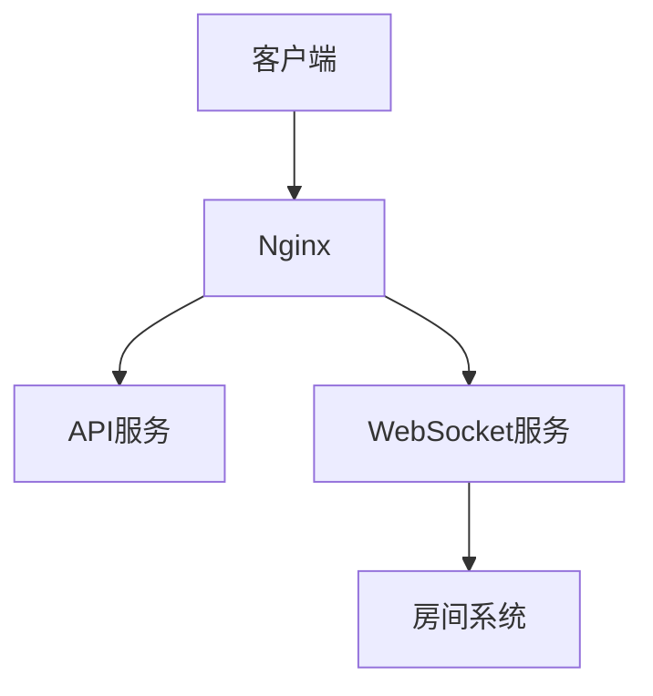
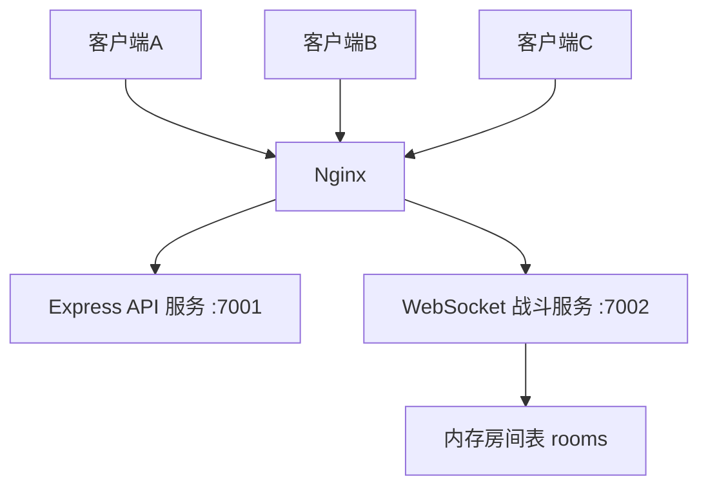

# 微信小游戏后端开发（三）：房间系统（双人联机核心）

上一篇我们完成了 **第 2 步：WebSocket 战斗服务**，已经具备：

- 客户端连接
- 广播消息
- 心跳检测 `ping/pong`
- PM2 托管
- Nginx 代理 `/ws/`

但那一版仍然是“全局广播”：

> 任意一个客户端发消息，所有在线客户端都能收到。

这对于调试来说没问题，但对于真正的双人联机坦克游戏来说还远远不够。  
因为真实游戏应该是：

- A 和 B 在房间 `1001`
- C 和 D 在房间 `1002`
- `1001` 的消息不能发给 `1002`
- 每个房间最多 2 人

所以这一篇我们正式进入：

> **第 3 步：房间系统**

---

## 🧠 1. 本篇目标

这一篇要解决的问题很明确：

### 这一阶段要做什么？

我们要把当前的 WebSocket 服务，从“全局广播版”升级成“房间版”，实现：

- 创建房间
- 加入房间
- 房间人数限制为 2
- 房间内广播
- 断线自动离开房间
- 空房间自动销毁
- 查询当前房间列表（调试用）

最终达到的效果是：

> 两个客户端可以在同一个房间内通信，第三个客户端不能挤进去，不同房间互不干扰。

---

### 在整个架构中的位置

整体路线保持不变：

- **第 1 步：基础服务器搭建（已完成）**
- **第 2 步：WebSocket 战斗服务（已完成）**
- **第 3 步：房间系统（当前阶段）**
- **第 4 步：战斗同步**
- **第 5 步：数据系统（MySQL + Redis）**
- **第 6 步：微信接入 + 架构优化**

你可以把第 3 步理解成：

> 给双人联机加上“谁跟谁打”的规则层。

---

## 🧱 2. 架构图（必须先看懂）

这一阶段的整体入口没有变化，但 WebSocket 服务内部已经开始分层：



如果再展开一点，可以理解成这样：



### 这张图怎么理解？

- **客户端**：微信小游戏、浏览器测试页、或者 `wscat`
- **Nginx**：统一公网入口
- **API 服务**：处理 HTTP 接口
- **WebSocket 服务**：处理实时长连接
- **房间系统**：在 WebSocket 服务内部，负责把不同玩家分组

为什么房间系统先做成“内存版”？

因为当前目标是：

> 先把房间逻辑跑通

而不是一开始就把 Redis、数据库、匹配服务全上齐。  
当前阶段用内存版最简单，也最适合新手理解。

---

## 🚀 3. 一步一步实操（重点）

这一部分按真实开发顺序来，不跳步骤。

---

### 第一步：先理解房间最小模型

在开始写代码前，先把房间在服务端怎么存想清楚。

我们需要两个状态：

#### 1）全局房间表

```js
const rooms = new Map();
```

它表示：

- key：`roomId`
- value：房间对象

例如：

```js
{
  roomId: "1001",
  players: [ws1, ws2]
}
```

#### 2）每个连接当前在哪个房间

```js
ws.roomId = null;
```

如果玩家已经加入房间：

```js
ws.roomId = "1001";
```

### 为什么这么设计？

因为后面服务端处理消息时，必须知道两件事：

1. 当前所有房间有哪些
2. 当前这个连接属于哪个房间

只有这样，才能做到“只发给房间内的人”。

---

### 第二步：先备份第 2 步的 `server.js`

进入 `battle` 目录：

```bash
cd /srv/tank-game/battle
cp server.js server.step2.backup.js
```

### 为什么一定先备份？

因为第 2 步已经是一个能跑的版本了。  
先备份的好处是：

- 万一新代码出错，可以快速回滚
- 不会把已经能跑的版本覆盖丢失
- 这是正式开发里很好的习惯

---

### 第三步：用房间系统版代码替换 `server.js`

执行：

```bash
nano /srv/tank-game/battle/server.js
```

然后把下面完整代码全部替换进去。

完整代码在下面“完整代码”章节给出。

### 为什么这一步直接整份替换？

因为房间系统涉及的内容比较多：

- 全局房间表
- 单个连接状态
- 消息协议解析
- 房间广播
- 断线清理
- 空房销毁

如果只给零散代码片段，新手很容易漏掉上下文。  
所以当前阶段最稳的方式就是：

> **直接整份替换 `server.js`**

---

### 第四步：重启 battle 服务

代码替换完成后，执行：

```bash
pm2 restart tank-battle
```

然后查看日志：

```bash
pm2 logs tank-battle --lines 30
```

### 为什么这里不用改 Nginx？

因为这一步改的是 **battle 服务内部逻辑**，没有改：

- 端口
- Nginx 路径
- PM2 进程名

所以外层部署方式不变，只要让 PM2 重新加载代码即可。

---

### 第五步：连接 3 个客户端进行联调

建议使用 `wscat`：

```bash
wscat -c ws://127.0.0.1/ws/
```

开 3 个终端窗口，分别连接 3 个客户端。

### 为什么建议开 3 个？

因为这样一次性能测出：

- 客户端 1：创建房间
- 客户端 2：加入房间
- 客户端 3：尝试加入同一个房间，被拒绝

这正好把“双人限制”也一起验掉。

---

### 第六步：按顺序发送测试消息

#### 客户端 1：先看房间列表

```json
{"type":"get_rooms"}
```

预期返回：

```json
{"type":"room_list","rooms":[],"timestamp":...}
```

#### 客户端 1：创建房间

```json
{"type":"create_room","roomId":"1001"}
```

#### 客户端 2：加入房间

```json
{"type":"join_room","roomId":"1001"}
```

#### 客户端 3：尝试加入同一个房间

```json
{"type":"join_room","roomId":"1001"}
```

预期返回错误：

```json
{
  "type":"error",
  "message":"加入房间失败：房间 1001 已满（最多 2 人）"
}
```

#### 客户端 1：发送房间消息

```json
{"type":"room_chat","message":"hello room 1001 from client1"}
```

预期结果：

- 客户端 1 收到
- 客户端 2 收到
- 客户端 3 收不到

#### 客户端 3：在未加入房间的情况下发房间消息

```json
{"type":"room_chat","message":"i am not in room"}
```

预期返回错误：

```json
{
  "type":"error",
  "message":"发送房间消息失败：你还没有加入任何房间"
}
```

---

### 第七步：测试断线清理

先关闭客户端 2：

```bash
Ctrl + C
```

然后在客户端 1 里执行：

```json
{"type":"get_rooms"}
```

此时预期应该只剩下 1 人。

再关闭客户端 1：

```bash
Ctrl + C
```

服务端应自动销毁空房。

最后新开一个客户端查询：

```json
{"type":"get_rooms"}
```

预期返回：

```json
{"type":"room_list","rooms":[],"timestamp":...}
```

### 为什么要专门测断线清理？

因为真实游戏里玩家掉线是高频事件。  
如果断线不清理，就会出现：

- 房间里残留脏连接
- 房间明明空了却不销毁
- 后面玩家再进房间时状态错乱

所以断线清理是房间系统非常关键的一环。

---

## 💻 4. 完整代码（必须完整）

下面是房间系统版的完整 `server.js`。  
这份代码包含：

- 连接
- 房间创建
- 房间加入
- 房间广播
- 房间列表查询
- ping/pong
- 断线离房
- 空房销毁

```js
const http = require('http');
const WebSocket = require('ws');

// ================================
// 1. 基础配置
// ================================
const HOST = '0.0.0.0';
const PORT = 7002;

// 自增客户端ID
let nextClientId = 1;

// 房间表
// key: roomId
// value: { roomId, players: [ws1, ws2] }
const rooms = new Map();

// ================================
// 2. 创建 HTTP 服务
// ================================
const server = http.createServer((req, res) => {
  res.writeHead(200, { 'Content-Type': 'text/plain; charset=utf-8' });
  res.end('Tank Battle Room Server is running.\n');
});

// ================================
// 3. 创建 WebSocket 服务
// ================================
const wss = new WebSocket.Server({ server });

// ================================
// 4. 工具函数
// ================================

// 发消息给单个客户端
function sendToClient(ws, data) {
  if (ws.readyState === WebSocket.OPEN) {
    ws.send(JSON.stringify(data));
  }
}

// 获取房间对象
function getRoom(roomId) {
  return rooms.get(roomId);
}

// 广播给指定房间内所有玩家
function broadcastToRoom(roomId, data) {
  const room = rooms.get(roomId);
  if (!room) return;

  const message = JSON.stringify(data);

  room.players.forEach((player) => {
    if (player.readyState === WebSocket.OPEN) {
      player.send(message);
    }
  });
}

// 广播给房间内除自己以外的玩家
function broadcastToRoomExceptSelf(roomId, sender, data) {
  const room = rooms.get(roomId);
  if (!room) return;

  const message = JSON.stringify(data);

  room.players.forEach((player) => {
    if (player !== sender && player.readyState === WebSocket.OPEN) {
      player.send(message);
    }
  });
}

// 返回当前所有房间的简化信息（便于调试）
function getRoomList() {
  const list = [];

  rooms.forEach((room, roomId) => {
    list.push({
      roomId,
      playerCount: room.players.length,
      playerIds: room.players.map((player) => player.clientId)
    });
  });

  return list;
}

// 玩家离开当前房间
function leaveCurrentRoom(ws) {
  if (!ws.roomId) {
    return;
  }

  const roomId = ws.roomId;
  const room = rooms.get(roomId);

  if (!room) {
    ws.roomId = null;
    return;
  }

  room.players = room.players.filter((player) => player !== ws);

  console.log(`[房间离开] clientId=${ws.clientId} 离开房间 roomId=${roomId}`);

  // 通知房间内剩余玩家
  broadcastToRoom(roomId, {
    type: 'room_system',
    roomId,
    message: `客户端 ${ws.clientId} 已离开房间`,
    playerCount: room.players.length,
    timestamp: Date.now()
  });

  // 如果房间空了，就销毁房间
  if (room.players.length === 0) {
    rooms.delete(roomId);
    console.log(`[房间销毁] roomId=${roomId} 已无玩家，自动销毁`);
  } else {
    rooms.set(roomId, room);
  }

  ws.roomId = null;
}

// 创建房间
function handleCreateRoom(ws, data) {
  const roomId = String(data.roomId || '').trim();

  if (!roomId) {
    return sendToClient(ws, {
      type: 'error',
      message: '创建房间失败：roomId 不能为空',
      timestamp: Date.now()
    });
  }

  if (rooms.has(roomId)) {
    return sendToClient(ws, {
      type: 'error',
      message: `创建房间失败：房间 ${roomId} 已存在`,
      timestamp: Date.now()
    });
  }

  // 如果当前已经在别的房间里，先离开旧房间
  if (ws.roomId) {
    leaveCurrentRoom(ws);
  }

  const room = {
    roomId,
    players: [ws]
  };

  rooms.set(roomId, room);
  ws.roomId = roomId;

  console.log(`[房间创建] clientId=${ws.clientId} 创建房间 roomId=${roomId}`);

  sendToClient(ws, {
    type: 'create_room_success',
    roomId,
    clientId: ws.clientId,
    playerCount: room.players.length,
    timestamp: Date.now()
  });

  broadcastToRoom(roomId, {
    type: 'room_system',
    roomId,
    message: `客户端 ${ws.clientId} 创建并加入了房间`,
    playerCount: room.players.length,
    timestamp: Date.now()
  });
}

// 加入房间
function handleJoinRoom(ws, data) {
  const roomId = String(data.roomId || '').trim();

  if (!roomId) {
    return sendToClient(ws, {
      type: 'error',
      message: '加入房间失败：roomId 不能为空',
      timestamp: Date.now()
    });
  }

  const room = rooms.get(roomId);

  if (!room) {
    return sendToClient(ws, {
      type: 'error',
      message: `加入房间失败：房间 ${roomId} 不存在`,
      timestamp: Date.now()
    });
  }

  if (room.players.includes(ws)) {
    return sendToClient(ws, {
      type: 'error',
      message: `加入房间失败：你已经在房间 ${roomId} 中`,
      timestamp: Date.now()
    });
  }

  if (room.players.length >= 2) {
    return sendToClient(ws, {
      type: 'error',
      message: `加入房间失败：房间 ${roomId} 已满（最多 2 人）`,
      timestamp: Date.now()
    });
  }

  // 如果当前已经在别的房间里，先离开旧房间
  if (ws.roomId && ws.roomId !== roomId) {
    leaveCurrentRoom(ws);
  }

  room.players.push(ws);
  ws.roomId = roomId;

  console.log(`[房间加入] clientId=${ws.clientId} 加入房间 roomId=${roomId}`);

  sendToClient(ws, {
    type: 'join_room_success',
    roomId,
    clientId: ws.clientId,
    playerCount: room.players.length,
    timestamp: Date.now()
  });

  broadcastToRoom(roomId, {
    type: 'room_system',
    roomId,
    message: `客户端 ${ws.clientId} 加入了房间`,
    playerCount: room.players.length,
    timestamp: Date.now()
  });
}

// 房间内聊天/广播
function handleRoomChat(ws, data) {
  if (!ws.roomId) {
    return sendToClient(ws, {
      type: 'error',
      message: '发送房间消息失败：你还没有加入任何房间',
      timestamp: Date.now()
    });
  }

  const message = String(data.message || '').trim();

  if (!message) {
    return sendToClient(ws, {
      type: 'error',
      message: '发送房间消息失败：message 不能为空',
      timestamp: Date.now()
    });
  }

  const room = rooms.get(ws.roomId);

  if (!room) {
    return sendToClient(ws, {
      type: 'error',
      message: '发送房间消息失败：当前房间不存在',
      timestamp: Date.now()
    });
  }

  console.log(
    `[房间消息] roomId=${ws.roomId} clientId=${ws.clientId} message=${message}`
  );

  broadcastToRoom(ws.roomId, {
    type: 'room_chat',
    roomId: ws.roomId,
    clientId: ws.clientId,
    message,
    playerCount: room.players.length,
    timestamp: Date.now()
  });
}

// 查看房间列表（调试用）
function handleGetRooms(ws) {
  sendToClient(ws, {
    type: 'room_list',
    rooms: getRoomList(),
    timestamp: Date.now()
  });
}

// ================================
// 5. 连接事件
// ================================
wss.on('connection', (ws, req) => {
  const clientId = nextClientId++;
  const clientIp =
    req.headers['x-forwarded-for'] ||
    req.socket.remoteAddress ||
    'unknown';

  ws.clientId = clientId;
  ws.roomId = null;
  ws.isAlive = true;

  console.log('-----------------------------------');
  console.log('[连接成功] 新客户端已连接');
  console.log('[客户端ID]', ws.clientId);
  console.log('[客户端IP]', clientIp);
  console.log('[当前在线数]', wss.clients.size);
  console.log('-----------------------------------');

  sendToClient(ws, {
    type: 'welcome',
    clientId: ws.clientId,
    message: '连接 battle WebSocket 服务成功',
    onlineCount: wss.clients.size,
    timestamp: Date.now()
  });

  // 收到消息
  ws.on('message', (message) => {
    try {
      const text = message.toString();
      console.log('[收到原始消息]', `clientId=${ws.clientId}`, text);

      let data;
      try {
        data = JSON.parse(text);
      } catch (parseError) {
        return sendToClient(ws, {
          type: 'error',
          message: '消息格式错误：请发送 JSON 字符串',
          example: JSON.stringify({
            type: 'create_room',
            roomId: '1001'
          }),
          timestamp: Date.now()
        });
      }

      const { type } = data;

      switch (type) {
        case 'create_room':
          handleCreateRoom(ws, data);
          break;

        case 'join_room':
          handleJoinRoom(ws, data);
          break;

        case 'room_chat':
          handleRoomChat(ws, data);
          break;

        case 'get_rooms':
          handleGetRooms(ws);
          break;

        default:
          sendToClient(ws, {
            type: 'error',
            message: `未知消息类型：${type}`,
            supportedTypes: ['create_room', 'join_room', 'room_chat', 'get_rooms'],
            timestamp: Date.now()
          });
          break;
      }
    } catch (error) {
      console.error('[消息处理失败]', `clientId=${ws.clientId}`, error);

      sendToClient(ws, {
        type: 'error',
        message: '服务器处理消息失败',
        timestamp: Date.now()
      });
    }
  });

  // 收到 pong
  ws.on('pong', () => {
    ws.isAlive = true;
    console.log('[心跳响应] 收到客户端 pong', `clientId=${ws.clientId}`);
  });

  // 连接关闭
  ws.on('close', () => {
    console.log('-----------------------------------');
    console.log('[连接关闭] 一个客户端已断开');
    console.log('[客户端ID]', ws.clientId);
    console.log('[当前在线数]', wss.clients.size);
    console.log('-----------------------------------');

    leaveCurrentRoom(ws);
  });

  // 连接异常
  ws.on('error', (error) => {
    console.error('[WebSocket 连接异常]', `clientId=${ws.clientId}`, error);
  });
});

// ================================
// 6. 心跳检测
// ================================
const heartbeatInterval = setInterval(() => {
  wss.clients.forEach((ws) => {
    if (ws.isAlive === false) {
      console.log('[心跳检测] 客户端无响应，主动断开', `clientId=${ws.clientId}`);
      return ws.terminate();
    }

    ws.isAlive = false;
    ws.ping();

    console.log('[心跳检测] 已发送 ping', `clientId=${ws.clientId}`);
  });
}, 30000);

wss.on('close', () => {
  clearInterval(heartbeatInterval);
});

// ================================
// 7. 启动服务
// ================================
server.listen(PORT, HOST, () => {
  console.log('===================================');
  console.log('Tank Battle Room Server 已启动');
  console.log(`监听地址: ws://${HOST}:${PORT}`);
  console.log('推荐代理入口: /ws/');
  console.log('已支持消息类型: create_room / join_room / room_chat / get_rooms');
  console.log('===================================');
});
```

---

## 🧪 5. 测试方法（非常关键）

代码写完后，测试一定不能省略。

---

### 方法一：使用 `wscat` 测试（推荐）

先安装：

```bash
npm install -g wscat
```

或者直接用：

```bash
npx wscat -c ws://127.0.0.1/ws/
```

---

### 1）连接 3 个客户端

开 3 个窗口，分别执行：

```bash
wscat -c ws://127.0.0.1/ws/
```

连接成功后，每个客户端都会收到欢迎消息，例如：

```json
{
  "type":"welcome",
  "clientId":1,
  "message":"连接 battle WebSocket 服务成功",
  "onlineCount":1,
  "timestamp":...
}
```

---

### 2）查询房间列表

在客户端 1 发送：

```json
{"type":"get_rooms"}
```

预期返回：

```json
{"type":"room_list","rooms":[],"timestamp":...}
```

---

### 3）创建房间

客户端 1 发送：

```json
{"type":"create_room","roomId":"1001"}
```

预期返回：

```json
{
  "type":"create_room_success",
  "roomId":"1001",
  "clientId":1,
  "playerCount":1,
  "timestamp":...
}
```

---

### 4）加入房间

客户端 2 发送：

```json
{"type":"join_room","roomId":"1001"}
```

预期返回：

```json
{
  "type":"join_room_success",
  "roomId":"1001",
  "clientId":2,
  "playerCount":2,
  "timestamp":...
}
```

---

### 5）第三人加入失败

客户端 3 发送：

```json
{"type":"join_room","roomId":"1001"}
```

预期返回：

```json
{
  "type":"error",
  "message":"加入房间失败：房间 1001 已满（最多 2 人）",
  "timestamp":...
}
```

---

### 6）房间内聊天

客户端 1 发送：

```json
{"type":"room_chat","message":"hello room 1001 from client1"}
```

预期结果：

- 客户端 1 收到
- 客户端 2 收到
- 客户端 3 收不到

---

### 7）未加入房间不能发房间消息

客户端 3 发送：

```json
{"type":"room_chat","message":"i am not in room"}
```

预期返回：

```json
{
  "type":"error",
  "message":"发送房间消息失败：你还没有加入任何房间",
  "timestamp":...
}
```

---

### 8）测试断线清理

关闭客户端 2：

```bash
Ctrl + C
```

客户端 1 再执行：

```json
{"type":"get_rooms"}
```

应看到房间只剩 1 人。

再关闭客户端 1：

```bash
Ctrl + C
```

此时服务端应打印：

```text
[房间销毁] roomId=1001 已无玩家，自动销毁
```

最后新开一个客户端查询房间：

```json
{"type":"get_rooms"}
```

应返回：

```json
{"type":"room_list","rooms":[],"timestamp":...}
```

---

### 方法二：浏览器控制台测试

打开浏览器控制台，执行：

```js
const ws = new WebSocket('ws://你的服务器公网IP/ws/');

ws.onopen = () => {
  console.log('WebSocket 已连接');
  ws.send(JSON.stringify({ type: 'get_rooms' }));
};

ws.onmessage = (event) => {
  console.log('收到消息：', event.data);
};

ws.onclose = () => {
  console.log('连接已关闭');
};

ws.onerror = (err) => {
  console.error('连接出错：', err);
};
```

创建房间：

```js
ws.send(JSON.stringify({ type: 'create_room', roomId: '1001' }));
```

发送房间消息：

```js
ws.send(JSON.stringify({ type: 'room_chat', message: 'hello room from browser' }));
```

---

### 方法三：最小 HTML 测试页

```html
<!DOCTYPE html>
<html lang="zh-CN">
<head>
  <meta charset="UTF-8" />
  <title>Room WebSocket Test</title>
</head>
<body>
  <h1>房间系统测试页</h1>

  <input id="msgInput" type="text" placeholder='输入 JSON，例如 {"type":"get_rooms"}' style="width: 520px;" />
  <button id="sendBtn">发送</button>

  <pre id="log"></pre>

  <script>
    const logEl = document.getElementById('log');
    const inputEl = document.getElementById('msgInput');
    const sendBtn = document.getElementById('sendBtn');

    const ws = new WebSocket('ws://你的服务器公网IP/ws/');

    function log(message) {
      logEl.textContent += message + '\n';
    }

    ws.onopen = () => {
      log('✅ WebSocket 已连接');
    };

    ws.onmessage = (event) => {
      log('📩 收到消息: ' + event.data);
    };

    ws.onclose = () => {
      log('❌ 连接已关闭');
    };

    ws.onerror = (error) => {
      log('⚠️ 连接异常: ' + JSON.stringify(error));
    };

    sendBtn.onclick = () => {
      const text = inputEl.value.trim();
      if (!text) return;

      ws.send(text);
      log('➡️ 已发送: ' + text);
      inputEl.value = '';
    };
  </script>
</body>
</html>
```

---

## ⚠️ 6. 踩坑记录（必须）

真实开发中，房间系统最容易踩的坑并不是“写不出代码”，而是状态管理没想清楚。

---

### 坑 1：发普通文本导致解析失败

#### 现象

你像第 2 步那样直接发：

```text
hello
```

结果收到错误。

#### 原因

因为这一版服务已经要求客户端发送 **JSON 字符串**，服务端会先执行：

```js
JSON.parse(text)
```

#### 解决方法

必须按 JSON 发：

```json
{"type":"create_room","roomId":"1001"}
```

---

### 坑 2：房间人数没有限制

#### 现象

第三个客户端居然也能进来。

#### 原因

加入房间时如果忘了判断人数，就会失去“双人房”的业务约束。

#### 解决方法

必须加上：

```js
if (room.players.length >= 2) {
  return sendToClient(ws, {
    type: 'error',
    message: `加入房间失败：房间 ${roomId} 已满（最多 2 人）`,
    timestamp: Date.now()
  });
}
```

---

### 坑 3：断线后不清理房间

#### 现象

玩家明明已经掉线，但房间里还残留着它。

#### 原因

只监听了 `close`，但没有在 `close` 时真正把玩家从房间数组里删掉。

#### 解决方法

在 `ws.on('close')` 中调用：

```js
leaveCurrentRoom(ws);
```

并在 `leaveCurrentRoom` 中完成：

- 从房间里删除该玩家
- 通知房间剩余玩家
- 如果房间空了就销毁

---

### 坑 4：空房间不销毁

#### 现象

玩家都退出了，但 `get_rooms` 还能看到空房间残留。

#### 原因

只删除了房间里的玩家，没有处理“房间没人”的情况。

#### 解决方法

必须加这段：

```js
if (room.players.length === 0) {
  rooms.delete(roomId);
  console.log(`[房间销毁] roomId=${roomId} 已无玩家，自动销毁`);
}
```

---

### 坑 5：房间消息又发成了全局广播

#### 现象

本来想只给房间成员发，结果所有客户端都收到了。

#### 原因

不小心还在用全局广播函数。

#### 解决方法

房间消息要走：

```js
broadcastToRoom(ws.roomId, data);
```

而不是：

```js
broadcast(data);
```

---

### 坑 6：客户端 3 看起来像加入成功，其实是终端输出贴错了

#### 现象

调试时日志明明显示有 `clientId=3`，但终端输出贴出来却像客户端 2 的复制版。

#### 原因

多窗口测试时，最容易贴错窗口内容。

#### 解决方法

调试联机功能时建议：

- 每个窗口都写清楚“客户端 1 / 2 / 3”
- 重点观察 `clientId`
- 同时结合服务端日志一起判断

---

## 📦 7. 本阶段成果总结

到这里，第 3 步已经真正完成闭环。

你已经具备了这些能力：

### 1. 双人房间系统

服务端已经能把连接从“全局池”分组到“房间”中，这是联机游戏后端第一次真正进入业务逻辑层。

---

### 2. 房间人数限制

每个房间最多 2 人，这完全贴合双人坦克游戏当前阶段的业务目标。

---

### 3. 房间内隔离广播

同一个房间里的玩家可以互相通信，不同房间不会互相干扰。

这已经不是简单聊天，而是后续“移动同步、子弹同步、战斗状态同步”的地基。

---

### 4. 断线自动清理

当玩家断开连接时，服务端会自动：

- 让该玩家离开房间
- 通知剩余房间成员
- 在空房时自动销毁房间

这对真实联机游戏非常重要。

---

### 5. 房间状态可观测

通过 `get_rooms`，你已经能在调试阶段实时观察服务端房间状态。

这对于新手理解“服务端到底存了什么”非常有帮助。

---

## 🔥 8. 下一步预告

下一篇我们会进入：

> **第 4 步：战斗同步**

这一阶段会真正开始接近游戏服务器核心：

- 输入同步
- 玩家移动同步
- 服务端权威状态
- tick / 帧循环基础模型

为什么不建议直接做“客户端位置直发”？

因为那种方式虽然简单，但很容易：

- 抖动
- 穿墙
- 不一致
- 被作弊

所以更推荐从：

> **输入同步（Input Sync）**

开始做，这是更接近专业游戏后端的路线。

---

## 结语

第 3 步看起来只是“做房间”，但它实际上已经把你的联机坦克游戏从“能连上”推进到了“能组织对局”。

这一步完成后，整个项目就从基础设施阶段进入了真正的游戏逻辑阶段。

先把房间系统做扎实，后面的同步系统才会顺利推进。
