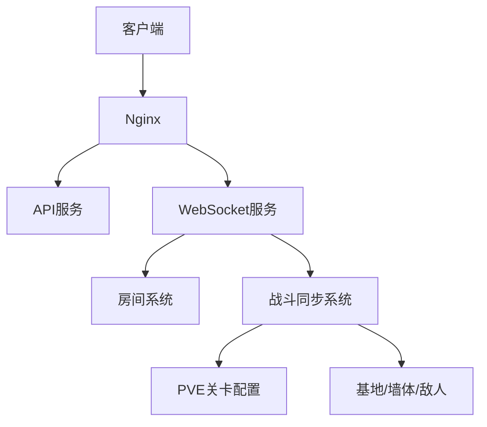
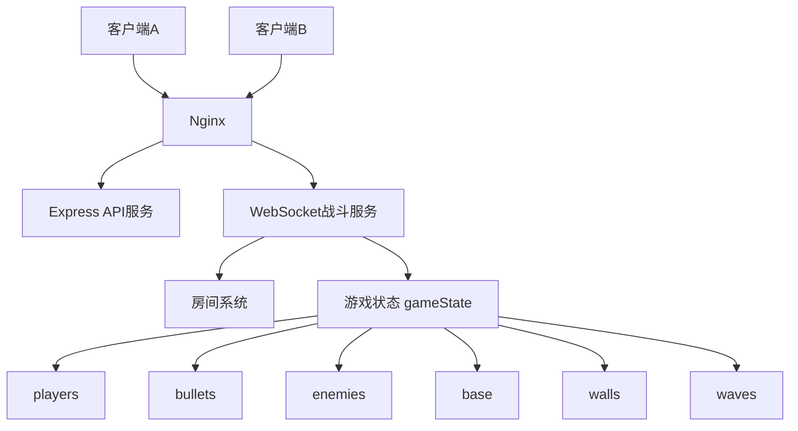

# 微信小游戏后端开发（四）：战斗同步系统（输入同步、PVE 波次与地图配置）

前面三步，我们已经完成了：

- **第 1 步：基础服务器搭建**
- **第 2 步：WebSocket 战斗服务**
- **第 3 步：房间系统**

到这里，项目已经具备了：

- 两个客户端实时连接
- 房间创建 / 加入
- 房间内广播
- PM2 托管
- Nginx 代理 `/ws/`

但这还只是“能连上、能进房”。

真正的游戏后端核心，是第 4 步：

> **战斗同步**

也就是：

- 玩家如何移动
- 子弹如何飞行
- 服务端如何统一计算状态
- 敌人如何生成与推进
- 基地如何被保护
- 一局战斗如何判定成功或失败

这一篇，我们就把第 4 步完整串起来。

---

## 🧠 1. 本篇目标

这一篇要解决的问题是：

### 1）客户端不能直接改位置
客户端不能直接上传坐标，否则会带来：

- 不同步
- 抖动
- 穿模
- 作弊

所以必须改成：

> 客户端发输入，服务端算结果

---

### 2）战斗必须由服务端统一推进
也就是：

- 玩家移动由服务端 tick 推进
- 子弹由服务端创建和推进
- 命中由服务端判断
- 敌人由服务端控制
- 成功 / 失败由服务端判定

---

### 3）PVE 双人闯关要跑通闭环
这一篇的最终目标不是单纯“能移动”，而是：

- 双人协作出生
- 保护基地（金鹰）
- 敌人按波次刷新
- 玩家可击杀敌人
- 敌人可攻击基地
- 全部清空后成功
- 基地爆掉后失败

---

## 🧱 2. 架构图

先看这一阶段的整体结构：



如果进一步展开，可以理解成：



### 这张图怎么理解？

到了第 4 步以后，WebSocket 服务内部已经不再只是“广播消息”，而是开始维护真正的游戏状态。

也就是说，一个房间内部除了“谁在里面”之外，还要知道：

- 玩家位置
- 玩家血量
- 子弹列表
- 敌人列表
- 基地状态
- 墙体状态
- 当前波次
- 战斗结果

---

## 🚀 3. 第 4 步完整拆分

为了避免一口气做太乱，第 4 步建议拆成 7 个小部分：

### 4-1 输入同步基础

目标：

- 客户端不直接发坐标
- 客户端只发输入
- 服务端保存输入状态

核心内容：

- `input`
- `inputs`
- `prevInputs`

---

### 4-2 玩家移动同步

目标：

- 服务端按 tick 推进玩家位置
- 方向互斥
- 边界限制
- 只在状态变化时广播

核心内容：

- `updatePlayers()`
- `clampPlayerPosition()`

---

### 4-3 子弹同步

目标：

- 玩家开火
- 服务端创建子弹
- 子弹飞行
- 子弹越界删除

核心内容：

- `createBulletFromPlayer()`
- `updateBullets()`

---

### 4-4 命中检测基础

目标：

- 子弹命中玩家
- 玩家掉血
- 玩家死亡
- 广播 `hit_event`

核心内容：

- `checkBulletsHitPlayers()`
- `hp`
- `isDead`

---

### 4-5 PVE 战斗闭环

目标：

- `mode: pve`
- 双人闯关出生点
- 友军不可互伤
- 敌人生成
- 敌人移动
- 敌人子弹
- 波次刷怪
- success / fail

核心内容：

- `waveConfigs`
- `enemies`
- `base`
- `battle_result`

---

### 4-6 地图配置化

目标：

- 玩家出生点由配置控制
- 基地位置由配置控制
- 敌人刷点由配置控制
- 墙体配置化
- 基地保护层
- 子弹打墙

核心内容：

- `levelConfig`
- `walls`
- `brick / steel`
- `resolveBulletVsWall()`

---

### 4-7 PVE 可玩化收口

目标：

- 子弹对撞按威力抵消
- 形成完整双人闯关基础原型
- 为后续接第 5 步数据系统打基础

核心内容：

- `resolveBulletVsBullet()`
- `wave_start / wave_cleared`
- `battle_result: success / fail`

---

## 🚀 4. 一步一步实操（重点）

### 第一步：把客户端坐标同步改成输入同步

错误做法：

```json
{
  "type": "move",
  "x": 100,
  "y": 200
}
```

正确做法：

```json
{
  "type": "input",
  "input": {
    "up": true,
    "shoot": false
  }
}
```

也就是客户端只告诉服务端“我按了什么”，由服务端统一计算结果。

---

### 第二步：给玩家增加服务端状态

每个玩家在服务端维护：

```js
{
  clientId,
  x,
  y,
  dir,
  team,
  speed,
  hp,
  isDead,
  bulletType,
  bulletPower,
  inputs,
  prevInputs
}
```

这样服务端才能统一掌握：

- 位置
- 朝向
- 血量
- 输入
- 子弹能力

---

### 第三步：加入 tick 循环

当前我们使用：

```js
const TICK_RATE = 20;
const TICK_INTERVAL = 1000 / TICK_RATE;
```

也就是每秒 20 帧、每 50ms 更新一次。

这是整个战斗服的心脏。

---

### 第四步：加入玩家移动同步

在每一帧中，根据输入推进玩家位置：

```js
if (player.inputs.up) {
  player.y -= player.speed;
  player.dir = 'up';
}
if (player.inputs.down) {
  player.y += player.speed;
  player.dir = 'down';
}
if (player.inputs.left) {
  player.x -= player.speed;
  player.dir = 'left';
}
if (player.inputs.right) {
  player.x += player.speed;
  player.dir = 'right';
}
```

并通过：

```js
clampPlayerPosition(player);
```

保证不会跑出地图边界。

---

### 第五步：加入子弹同步

玩家按下开火时，由服务端创建子弹：

```js
const bullet = createBulletFromPlayer(player);
room.gameState.bullets.push(bullet);
```

然后每一帧推进子弹位置：

```js
switch (bullet.dir) {
  case 'up':
    bullet.y -= bullet.speed;
    break;
  case 'down':
    bullet.y += bullet.speed;
    break;
  case 'left':
    bullet.x -= bullet.speed;
    break;
  case 'right':
    bullet.x += bullet.speed;
    break;
}
```

越界后自动删除。

---

### 第六步：加入命中检测

当前命中采用简化矩形检测：

```js
Math.abs(bullet.x - player.x) <= PLAYER_HIT_RADIUS &&
Math.abs(bullet.y - player.y) <= PLAYER_HIT_RADIUS
```

命中后：

- 子弹删除
- 玩家掉血
- `hp <= 0` 时 `isDead = true`
- 广播 `hit_event`

---

### 第七步：切到 PVE 模式

你的项目方向后来明确为：

- 双人闯关
- 友军不可互伤
- 地图从下往上
- 保护金鹰
- 接近经典《坦克大战》

所以第 4 步里引入：

```js
mode: 'pvp' / 'pve'
```

在 `pve` 下：

- 两个玩家从底部出生
- 两人默认朝上
- 玩家子弹不能打到队友
- 房间里会初始化 `base`
- 房间里会维护 `enemies`

---

### 第八步：加入敌人同步

敌人进入同一个 `gameState`：

```js
enemies: []
```

每个敌人也有：

```js
{
  enemyId,
  type,
  x,
  y,
  dir,
  team,
  speed,
  hp,
  isDead,
  lastShootAt,
  bulletType,
  bulletPower,
  bulletSpeed,
  shootInterval
}
```

然后实现：

- 定时刷出敌人
- 每帧向下推进
- 定时发射子弹

---

### 第九步：加入波次系统

当前通过 `waveConfigs` 配置敌人波次：

```js
waveConfigs: [
  {
    waveIndex: 1,
    spawnInterval: 1500,
    enemies: [...]
  },
  {
    waveIndex: 2,
    spawnInterval: 1200,
    enemies: [...]
  }
]
```

逻辑是：

- 当前波敌人按间隔刷出
- 清空后广播 `wave_cleared`
- 如果还有下一波，则广播 `wave_start`
- 所有波都清空后 `success`

---

### 第十步：加入基地与失败判定

基地进入 `gameState`：

```js
base: {
  x,
  y,
  hp,
  isDestroyed
}
```

敌人子弹命中基地后：

- `base.hp -= bullet.power`
- 如果血量归零：
  - `isDestroyed = true`
  - 广播 `battle_result: fail`

---

### 第十一步：地图配置化

为了支持真正的关卡系统，这一版把地图抽成：

```js
levelConfig
```

包括：

- 地图大小
- 玩家出生点
- 基地位置
- 墙体
- 敌人刷点
- 波次配置

这样后面增加第 2 关、第 3 关，只需要换配置，不用重写逻辑。

---

### 第十二步：加入墙体与基地保护层

墙体分两种：

- `brick`：砖墙，可被打掉
- `steel`：钢墙，当前版不可被摧毁

基地周围放“保护墙”，形成经典坦克大战里保护老家的感觉。

---

### 第十三步：加入子弹对撞抵消

每颗子弹现在都有：

```js
bulletType
power
```

不同阵营子弹相撞时：

- 威力相同：两颗都消失
- 威力不同：弱的消失，强的减少威力继续飞

这样后面做“强化炮弹”“高级敌人子弹”会很自然。

---

## 💻 5. 完整代码说明

完整代码已整理为第 4 步最终整合版，建议直接下载使用，不要手工复制零散片段。

主要能力包含：

- `mode: pvp / pve`
- 双人房间
- 输入同步
- 玩家移动
- 子弹同步
- 命中检测
- 友军不可互伤
- 敌人生成
- 敌人子弹
- 基地
- 墙体
- 子弹打墙
- 子弹对撞按威力抵消
- 波次刷怪
- success / fail

---

## 🧪 6. 测试方法

### 1）重启服务

```bash
pm2 restart tank-battle
pm2 flush
pm2 logs tank-battle --lines 30
```

---

### 2）创建 PVE 房间

客户端 1：

```json
{"type":"create_room","roomId":"9001","mode":"pve","levelId":1}
```

客户端 2：

```json
{"type":"join_room","roomId":"9001"}
```

---

### 3）查看房间

```json
{"type":"get_rooms"}
```

---

### 4）重点观察 `state_update`

你应该能看到：

- `mode`
- `levelId`
- `players`
- `bullets`
- `enemies`
- `base`
- `walls`
- `waveIndex`
- `waveStatus`
- `status`
- `result`

---

### 5）看墙体效果

如果子弹命中砖墙，会广播：

```json
{
  "type":"wall_destroyed",
  "roomId":"9001",
  "wallId":12
}
```

钢墙当前不会被打掉。

---

### 6）看波次推进

- 清掉一波敌人：收到 `wave_cleared`
- 下一波开始：收到 `wave_start`
- 所有波次清空：收到 `battle_result: success`

---

### 7）看失败判定

如果基地被打爆：

```json
{
  "type":"battle_result",
  "mode":"pve",
  "result":"fail",
  "reason":"base_destroyed"
}
```

如果双人都死了：

```json
{
  "type":"battle_result",
  "mode":"pve",
  "result":"fail",
  "reason":"all_players_dead"
}
```

---

### 8）看子弹对撞

如果玩家子弹和敌人子弹相撞，会收到：

```json
{
  "type":"bullet_cancel_event",
  "roomId":"9001",
  "bulletAId":12,
  "bulletBId":13
}
```

---

## ⚠️ 7. 踩坑记录

### 坑 1：客户端直接发坐标
如果客户端直接上传坐标，服务端就失去了权威控制，极易导致同步错误和作弊。

正确方式必须是：

```json
{"type":"input","input":{"up":true}}
```

---

### 坑 2：静止时仍然刷屏
如果每一帧都广播完整状态，终端会疯狂滚动。

解决办法是：

> 只有状态变化时才广播

也就是使用 `lastBroadcastState` 做快照比较。

---

### 坑 3：边界开火子弹瞬间消失
如果子弹生成带偏移，而坦克又贴在边界上，子弹可能一出生就越界。

最终收口方案是：

> 当前阶段子弹直接从当前坐标生成，不做偏移

这样更稳，也更适合调试。

---

### 坑 4：方向输入不互斥
如果 `up = true` 后再发 `right = true`，但不清理其他方向，就会变成斜向移动。

坦克类玩法更适合：

- 方向互斥
- 开火独立

---

### 坑 5：PVE 裸地图基地太容易被打爆
如果没有墙体和基地保护层，敌人子弹很容易直达基地。

所以地图层至少要有：

- 基地
- 基地保护墙
- 墙体掩体
- 刷怪点

---

### 坑 6：日志里敌人子弹的 `ownerId` 容易和玩家 `clientId` 混淆
因为敌人也有自己的 `enemyId`。

所以调试时建议明确区分：

- 玩家子弹日志
- 敌人子弹日志

---

### 坑 7：PVE 成功 / 失败不能写死在局部逻辑
不要把“清光敌人就 success”散落到多个函数里。

更合理的方式是：

- 波次系统决定什么时候推进波次
- 战斗结果系统统一决定 success / fail

---

## 📦 8. 本阶段成果总结

到这里，第 4 步已经基本完整收口。

你现在已经具备的能力包括：

### 1）输入同步
客户端只发输入，服务端统一算移动和战斗状态。

### 2）玩家移动同步
服务端按 tick 推进角色位置，方向互斥，边界受控。

### 3）子弹同步
玩家和敌人都能由服务端创建并推进子弹。

### 4）命中与死亡
玩家、敌人、基地都能参与命中判定，支持掉血和死亡。

### 5）PVE 双人闯关基础版
支持：

- 双人协作出生
- 友军不可互伤
- 基地保护
- 敌人生成与波次
- 成功 / 失败判定

### 6）地图配置化
地图包含：

- 出生点
- 基地
- 墙体
- 刷怪点
- 波次

### 7）子弹对撞抵消
玩家子弹和敌人子弹可按威力对撞抵消。

这已经形成了一个：

> **可运行的双人坦克闯关战斗服原型**

---

## 🔥 9. 下一步预告

第 4 步到这里，主线已经基本完成。

接下来最自然的下一步就是：

# 第 5 步：数据系统（MySQL + Redis）

这一阶段会解决：

- 用户数据持久化
- 关卡进度存档
- 双人队伍进度
- 在线状态
- 房间临时状态

尤其是你前面提到的：

- `(A,B)` 一组进度
- `(A,C)` 独立进度

这一步必须进入数据库设计层面。

---

## 结语

第 4 步是整个项目里最关键、最难，也最能拉开差距的一步。

前面三步更多是在搭基础设施，而第 4 步真正决定了：

> 你的项目是不是一个“能玩的战斗服”

到这里，你的双人坦克小游戏后端已经具备了非常扎实的实时战斗基础。

后面接上 MySQL、Redis、微信小游戏前端，整个项目就会真正成形。
